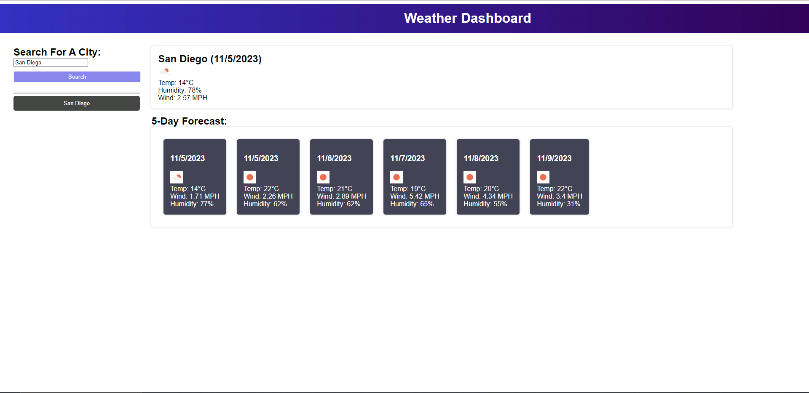

# <Get-Your-Weather>

## Description

By creating this project I further my knowledge into using APIs. This weather app will help users to be aware of weather conditions when traveling across the US. While working with this app, I acquire experience manipulating API data and use it as needed.

## Table of contents

N/A

## Installation

This is a web application. It does not require any software installation.

## Usage

When the user enters the weather app, they are prompt to enter a city name. After typing a city and clicking the search button below, they are presented with the current weather and a 5-day forecast. Also, the user can see a list of previous searches where they can press a previous search and the current weather will change into the picked search history city.
